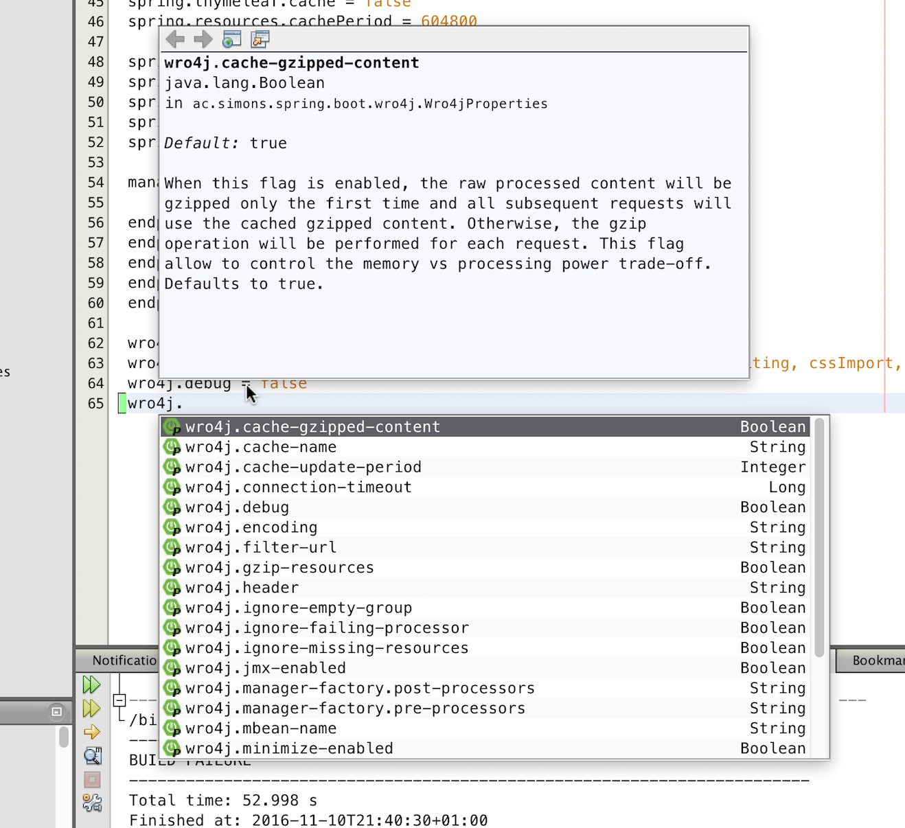

# Keine Magie: Individuelle Spring-Boot-Module

**Important:** _The commits and commit messages have been written very carefully to guide you through reading this project and understanding the talk. Please take your time to study them if you don't understand something_.

**Wichtig:** _Die Commits und die Kommentare sind sehr ausführlich und beinhalten  wichtige Teile des Vortrages. Vielleicht helfen sie weiter, wenn etwas unverständlich ist._

## Vortrag auf der W-JAX 2016

_Note: The talk and the slides are in German as W-JAX con is a German conference, the demo, the readme and other artifacts inside this repo are in English in hope they are useful to a broader audience._

Dieses Repository beinhaltet den Foliensatz und die komplette Demo des Vortrages.

Das Ziel des Vortrages ist, zu zeigen, dass die automatische Konfiguration des Spring Frameworks durch Spring Boot keine Magie ist und wie man sich die Möglichkeiten automatischer Konfiguration zu nutze machen kann.

Das Beispiel des Vortrag ist ein eigener Dialekt für die Template Engine [Thymeleaef](http://www.thymeleaf.org). Es wird ein HTML Tag entwickelt, dass den [Spring Boot Banner](http://docs.spring.io/spring-boot/docs/current/reference/htmlsingle/#boot-features-banner) als ASCII Art innerhalb eines Thymeleaf Templates anzeigen kann.

Dabei werden folgende Themen demonstriert:

* Der korrekte Weg, aus einer _Configuration_ Klasse eine _AutoConfiguration_ Klasse zu machen, die innerhalb eines _*-spring-boot-starter.jar_ automatisch ohne einen "Full-Classpath-Scan" gefunden wird
* Vorstellung der Annotationen `ConditionalOnClass`, `ConditionalOnProperty`, `ConditionalOnBean` sowie deren Negationen
* Möglichkeiten zum Debugging automatischer Konfiguration

## Fragen und Antworten

Während des Vortrags kam die Frage auf, wie man die Benutzer eines Starters bei der Konfiguration desselben unterstützen könne. 

Die üblichen Java IDEs NetBeans, Eclipse und IntelliJ bieten eine Autovervollständigung für die Properties aller möglichen Starter.

Dieses Feature kann sehr einfach für eigene Starter realisiert werden. In [Appendix B. Configuration meta-data](http://docs.spring.io/spring-boot/docs/current/reference/html/configuration-metadata.html) wird beschrieben, wie eine Datei `META-INF/spring-configuration-metadata.json` aussehen muss, die die relevanten Informationen beinhaltet.

Setzt man in seinem Starter Klassen ein, die mit `@ConfigurationProperties` annotiert sind, um seine Properties zentral zur Verfügung hab und hat die Attribute der Klassen ordentlich mit JavaDoc Kommentaren dokumentieren, kann obige Datei generieren lassen:

```
    <dependency>
      <groupId>org.springframework.boot</groupId>
      <artifactId>spring-boot-configuration-processor</artifactId>
      <optional>true</optional>
    </dependency>
```

In meinem [wro4j-spring-boot-starter](https://github.com/michael-simons/wro4j-spring-boot-starter) habe ich dies im Commit [#a59b3f4](https://github.com/michael-simons/wro4j-spring-boot-starter/commit/a59b3f4341825f83304c9db3e0daaddf9552096f) exemplarisch gemacht, das Ergebnis ist direkt sichtbar:



## Weitere Informationen

Der Vortrag existiert auch in einer [englischen Version](https://github.com/michael-simons/springio2016), die auf der [Spring I/O 2016](http://www.springio.net) vorgestellt wurde. Ein Videomitschnitt ist auf YouTube zu sehen: [Customize your Spring Boot experience by writing your own Spring Boot starter](https://www.youtube.com/watch?v=wSWA63rZfGo).

## Kontakt

Gerne über [michael-simons.eu](http://michael-simons.eu) oder Twitter, ich bin [@rotnroll666](https://twitter.com/@rotnroll666).

## License

<a rel="license" href="http://creativecommons.org/licenses/by-nc-sa/4.0/"></a><br /><span xmlns:dct="http://purl.org/dc/terms/" property="dct:title">"Keine Magie: Individuelle Spring-Boot-Module"</span> von <a xmlns:cc="http://creativecommons.org/ns#" href="https://github.com/michael-simons/W-JAX2016" property="cc:attributionName" rel="cc:attributionURL">Michael J. Simons</a> ist lizenziert unter einer <a rel="license" href="http://creativecommons.org/licenses/by-nc-sa/4.0/">Creative Commons Namensnennung - Nicht-kommerziell - Weitergabe unter gleichen Bedingungen 4.0 International Lizenz</a>.

## Bildrechte der Präsentation

* "High Voltage Towers": © iStockphoto.com/[querbeet](http://www.istockphoto.com/portfolio/querbeet)
* "Old New Architecture Winnipeg": © iStockphoto.com/[photosmash](http://www.istockphoto.com/portfolio/photosmash)
* "Freddie Mercury": Still from Queens 1986 "A Kind Of Magic" music video